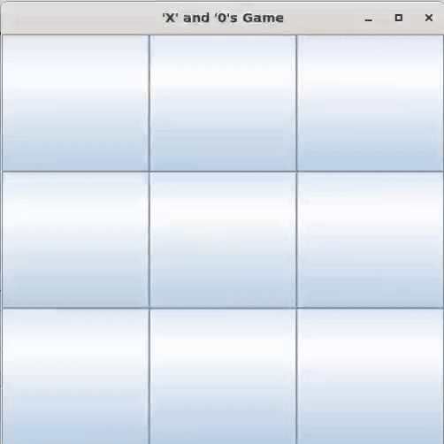

# XandOsGame

‘X’ and ‘0’s is a two-player game . Generally, there is a 3 X 3
grid, in which players take turns to mark the spaces with their respective symbol
i.e. 'X' or '0'. The player that succeeds in placing three of their symbols either
horizontally, vertically or diagonally, wins. 

